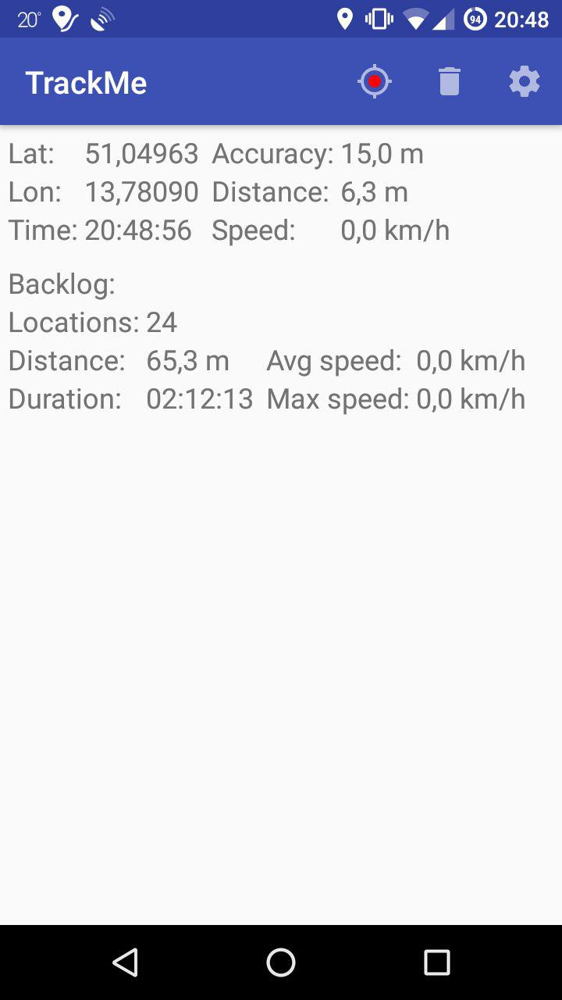
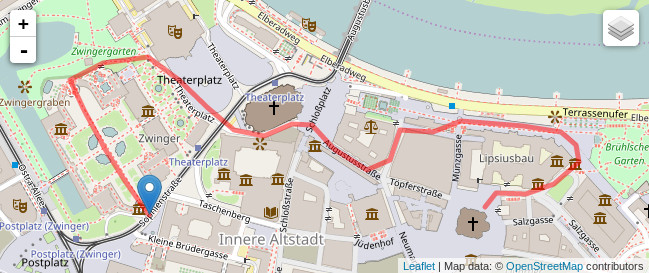

# TrackMe
Android app for tracking your locations and uploading them on your private server

# Description

TrackMe records your location while uploading it to your server.
It can be used to share current position and location history with family and friends, e.g. during vacation trips.

## Key Features

* Low battery consumption: GPS is only accessed every once in a while
* Configurable location recording: based on distance and/or elapsed time
* Tracking can be stopped at any time and continued at a later time
* Completely open source: you can decide who has access to your locations (or rather who doesn't)

# Examples

## Tracking activity

## Map With Recorded Location

# License
[GPL v3](http://www.gnu.org/licenses/gpl.html)
(c) [Alexander Heinlein](http://choerbaert.org)

